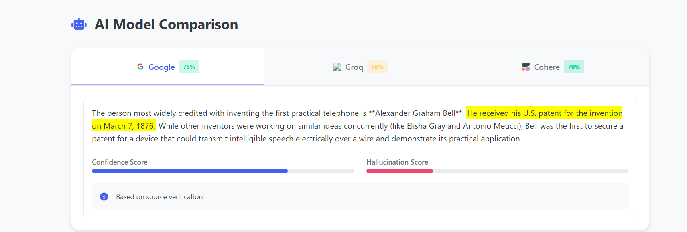

# AI-Hallucination-Detection
A modern Flask web application that verifies AI-generated responses from multiple LLM APIs (Google Gemini, Groq, Cohere) by cross-referencing with trusted sources (Wikipedia, DuckDuckGo, Google Search). The app highlights hallucinations, provides advanced analysis, and generates detailed PDF reports.

---

## 🚀 Features

- **Multi-Model Comparison:**  
  Queries Google Gemini, Groq, and Cohere for answers to your prompt.

- **Fact-Checking:**  
  Cross-references answers with Wikipedia, DuckDuckGo, and Google Search.

- **Hallucination Detection:**  
  Flags and highlights likely hallucinated sentences in AI responses.

- **Advanced Analysis:**  
  Computes response similarity, keyword overlap, and logical inferences.

- **Customizable PDF Reports:**  
  Download detailed, visually rich reports of your queries.

- **Modern UI:**  
  Clean interface with error handling and visual highlights.


## 🛠️ Requirements

- Python 3.8+
- Flask
- Hypercorn
- pdfkit & wkhtmltopdf
- google-generativeai
- groq
- cohere
- nltk
- sentence-transformers
- keybert
- autocorrect
- wikipedia
- duckduckgo-search
- aiohttp
- retry
- beautifulsoup4
- python-dotenv

Install all dependencies:

```bash
pip install -r requirements.txt
```

---

## ⚙️ Setup

1. **Clone the repository:**

   ```bash
   git clone https://github.com/rMohamedIbrahim/AI-Hallucination-Detection.git
   cd AI-Hallucination-Detection
   ```

2. **Set up environment variables:**  
   Create a `.env` file in the root directory:

   ```
   GOOGLE_API_KEY=your_google_api_key
   GROQ_API_KEY=your_groq_api_key
   COHERE_API_KEY=your_cohere_api_key
   ```

3. **Install wkhtmltopdf:**  
   Download and install from [wkhtmltopdf.org](https://wkhtmltopdf.org/).  
   Ensure the binary is in your system PATH.

4. **Download NLTK data (if needed):**

   ```python
   import nltk
   nltk.download('punkt')
   ```

---

## ▶️ Running the App

Start the server:

```bash
python app.py
```

The app runs at [http://localhost:8000](http://localhost:8000) by default.

<p align="center"></p>
<p align="center"></p>
<p align="center"></p>


---

## 📝 Usage

- Enter your prompt/question on the main page.
- The app queries multiple LLMs and cross-checks their answers.
- Results are displayed with hallucinated sentences highlighted.
- Click "Generate Report" to download a detailed PDF.

---

## 📁 Project Structure

```
.
├── app.py                # Main Flask app
├── ai_verifier.py        # Core logic for prompt processing and verification
├── ai_modules/           # Custom modules (PromptValidator, SourceVerifier, LogicalReasoner)
├── static/               # Static assets (CSS, JS, images)
├── templates/            # HTML templates (index.html, report.html)
├── requirements.txt      # Python dependencies
├── README.md             # Project documentation
└── uploads/              # (Optional) For file uploads
```

---

## 🎨 Customization

- **Templates:** Edit `templates/index.html` and `templates/report.html` for UI changes.
- **Styling:** Edit `static/style.css`.
- **APIs:** Add or remove LLMs in `ai_verifier.py` as needed.

---

## ❓ Troubleshooting

- **Missing API Keys:** Ensure all required keys are set in `.env`.
- **PDF Generation Fails:** Make sure `wkhtmltopdf` is installed and accessible.
- **Dependency Issues:** Double-check `requirements.txt` and your Python environment.

---


---
